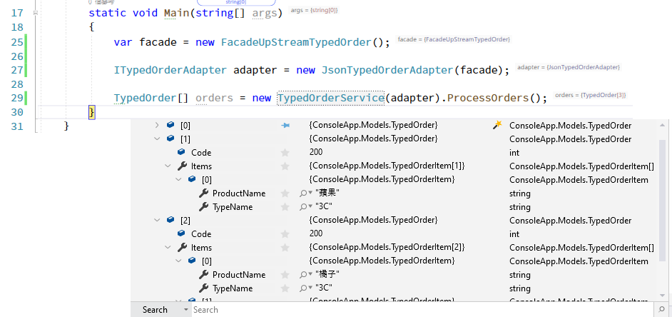

# ProcessJsonRequestDemo
```
{"Code":200,"Orders":[{"FruitName":"xxx花東產西瓜xxx"}]}
{"Code":200,"Orders":[{"3CName":"iPhone  X 64GB"}]}
```
如果向另一廠商取得訂單記錄的json格式如上, 由於屬性名稱是FruitName, 3CName,去除Name後,就是商品型別, 例如 3CName,表示Type=3C

我練習的程式是
1. 寫一個Facade object取得上述Json,並轉型為 UpStreamTypedOrderItem objet
2. 在 Adapter object裡, 將 UpStreamTypedOrderItem 轉型為 TypedOrderItem
3. 寫支 TypedOrderService 叫用 Adapter object 取得本程式需要的強型別物件

解析結果:

